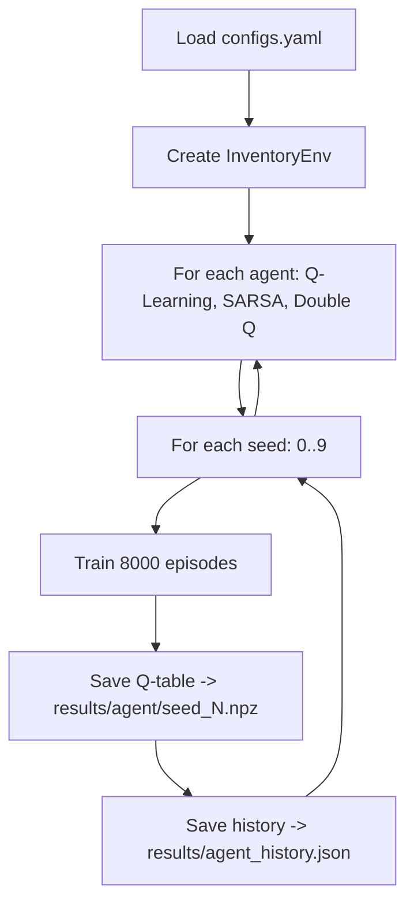

# ⚙️ Workflow: Training Pipeline

---

## Tổng quan

Training pipeline huấn luyện 3 RL agents trên InventoryEnv.

## Lệnh chạy

```bash
py experiments/train.py
```

## Quy trình



## Hyperparameters (configs.yaml)

| Param | Value | Ý nghĩa |
|-------|-------|---------|
| alpha | 0.15 | Tốc độ học |
| gamma | 0.99 | Hệ số chiết khấu |
| epsilon_start | 1.0 | Khám phá ban đầu |
| epsilon_end | 0.05 | Khám phá tối thiểu |
| epsilon_decay | 0.99998 | Decay per step |
| n_episodes | 8000 | Episodes per seed |
| n_seeds | 10 | Số seeds |

## Output

```
results/
├── q_learning/
│   ├── seed_0.npz
│   ├── ...
│   └── seed_9.npz
├── sarsa/
│   └── seed_*.npz
├── double_q_learning/
│   └── seed_*.npz
├── q_learning_history.json
├── sarsa_history.json
└── double_q_learning_history.json
```

## Lưu ý

> [!warning] Epsilon decay
> Ban đầu dùng `0.9995` → epsilon về 0.05 quá sớm (ep ~250).
> Đã fix thành `0.99998` → epsilon giảm dần đến ep ~5000.
> Xem [[Error/ERR-001]] cho chi tiết.
